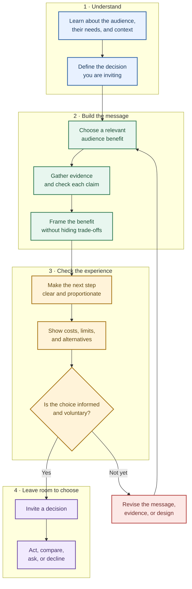

# Chapter 1: Persuasion—Helping People Notice, Understand, and Choose

Persuasion is often described as “getting people to say yes.” That definition is too small—and can make persuasion sound like a contest between a clever designer and an unsuspecting audience.

A more useful view is that persuasion is the practice of shaping **attention, interpretation, trust, and action**. A designer chooses what to make noticeable, how to explain it, what evidence to provide, and what next step to invite. Those choices can help someone make a decision that fits their needs. They can also pressure or mislead someone. The difference matters.

Consider a plain white T-shirt. The physical shirt does not change, but its presentation can:

- draw attention to its low price;
- describe it as a dependable everyday basic;
- show evidence about its fabric or how it was made;
- invite someone to buy it, compare it, or decide it is not for them.

The shirt is the same. The meaning people make of it—and the decision they make—may differ.

## Persuasion, coercion, and manipulation

Persuasion offers reasons, frames, or evidence in a way that leaves a person meaningfully free to decide. Coercion uses a threat or penalty to make refusal costly. Manipulation steers a choice by hiding important information, exploiting a vulnerability, or creating a misleading impression.

These categories are not always perfectly separated in real life. A design can contain honest information and still use unfair pressure. Ask not only whether a statement is technically true, but also whether the overall experience supports an informed, voluntary choice.

| Approach | What it does | What choice feels like | T-shirt example |
|---|---|---|---|
| Ethical persuasion | Gives relevant reasons and a clear invitation | “I can decide, and I understand what I’m choosing.” | Explains the shirt’s price, fit, and fabric, then offers a straightforward purchase button |
| Manipulation | Distorts the picture or exploits attention and emotion | “I was steered without a fair chance to understand.” | Calls it “almost sold out” without reliable stock information, or hides shipping costs until checkout |
| Coercion | Uses a threat or penalty to compel compliance | “I have to agree to avoid a consequence.” | A school or employer threatens an unrelated penalty unless someone buys the shirt |

Strong persuasion is not the same as maximum persuasion. A useful design helps people see what matters, evaluate it, and act—or decline—without being tricked.

## Cialdini’s principles of influence

Psychologist Robert Cialdini’s widely used framework describes recurring patterns that can make a request more influential. These are tendencies, not laws: people respond differently depending on the person, culture, context, and stakes. A principle can help explain a choice, but it does not prove that the choice is right.

1. **Reciprocity:** People often feel inclined to return a favor or respond to a benefit they have received. A clothing store might offer a useful fit guide before inviting a purchase. The guide should be genuinely helpful, not a hidden obligation.
2. **Commitment and consistency:** After making a voluntary commitment, people may prefer actions that fit it. Someone who has chosen to buy fewer, longer-lasting clothes may consider a T-shirt described with verifiable durability information. Do not turn a small action—such as clicking a poll—into pressure to make a larger purchase.
3. **Social proof:** When uncertain, people look to what others do. Reviews or the number of customers who chose a shirt can help, if the information is accurate and representative. Do not invent reviews or imply that popularity makes a product right for everyone.
4. **Liking:** People are more open to requests from people or organizations they like or identify with. Friendly photography or a relatable spokesperson can make a shirt feel appealing. Warmth should not be used to disguise weak evidence or a financial conflict.
5. **Authority:** Relevant expertise and credible evidence can guide judgment. A textile specialist explaining a fabric test may be useful; a person in a lab coat with no relevant expertise is not. Make credentials and claims checkable.
6. **Scarcity:** People may value an option more when it is limited or at risk of disappearing. A genuinely limited run can be described plainly. A false countdown or fabricated “only two left” message creates pressure by misrepresenting the facts.
7. **Unity:** People can be especially receptive to those they see as part of a shared identity or group. A campus club might present a shirt as part of a community fundraiser. Belonging should be an invitation, not a test of loyalty or a way to exclude people.

These principles describe ways influence can work; they are not a recipe for making every audience comply. Apply them with accurate information, appropriate context, and room to say no.

## Three more useful ideas

### Framing: the same facts can mean different things

A **frame** is the perspective that makes some parts of a situation more salient than others. “A $20 T-shirt” and “a T-shirt for about 55 cents a day over a year” can refer to the same price, but the second frame asks the audience to think about time and use. It is fair only if the time period is clear and the math is honest. A frame should clarify a relevant trade-off, not camouflage it.

### Defaults and friction: the path of least effort matters

Behavioral economics and interface design pay attention to **defaults**—what happens if someone does nothing—and to the effort required for each option. A preselected shirt size, an unchecked newsletter box, and an easy-to-find “continue without subscribing” option all shape behavior.

For a purchase, a sensible default might be no optional add-ons selected. Requiring several clicks to decline a donation while making “add donation” a single click is not a neutral convenience choice; it nudges people unevenly. Design the easiest path to respect the person’s likely intent, and make consequential choices clear and reversible where possible.

### The elaboration likelihood model: people do not always process a message the same way

The **elaboration likelihood model** distinguishes between more careful consideration of reasons and cues that work with less detailed thought. Someone choosing a shirt for a specific fabric requirement may read the material details closely. Someone browsing casually may notice a clear photo, a familiar retailer, or a concise label first.

This does not mean people are either “rational” or “irrational.” Attention, motivation, knowledge, and context vary. Make the quick cues honest, and make the fuller evidence easy to find. A pleasing image can help someone orient; it should not be the only support for an important claim.

## One shirt, several stories

Imagine a store listing the same plain white T-shirt in four different ways:

| Presentation | What gets attention | What the shopper may infer | What an ethical designer should check |
|---|---|---|---|
| “A simple everyday basic” | Familiarity and versatility | It may work with many outfits | Is the styling an example rather than a promise about everyone’s wardrobe? |
| “$20, with free pickup nearby” | Price and convenience | The total cost may be manageable | Are there conditions, extra fees, or limits on pickup? |
| “Chosen by 4,000 customers” | Social proof | Many people have bought it | Is the number current, real, and presented with enough context? |
| “Only 20 in this run” | Scarcity | Waiting may mean missing out | Is the limit genuine, and is it relevant to the shopper? |

Each presentation may be truthful, but each also directs attention differently. Designers should choose a frame because it helps people understand a meaningful feature—not merely because it is the frame most likely to produce a click.

## A practical path from message to choice

The diagram shows a responsible design sequence. It is not a guarantee of agreement: the audience may decide the product is not right for them.

For the T-shirt, “understand the audience” could mean learning that a student needs an inexpensive shirt for a one-day event. The relevant benefit might be the price and pickup location, not an elaborate sustainability story. If the designer claims the shirt is sustainably made, they should have evidence for that claim and explain what it means. The next step could be “Check sizes and pickup times,” not an urgent “Buy now” prompt.

## Ethical cautions

- **Tell the whole relevant truth.** A technically accurate headline can still mislead if costs, limits, or conditions are hidden.
- **Treat attention as something entrusted to you.** Avoid needless urgency, confusing layouts, and endless prompts that wear down a person’s ability to decide.
- **Be especially careful around vulnerability.** Children, people under financial stress, and people facing health or safety decisions may have less room to absorb pressure or recover from a bad choice.
- **Do not confuse a response with a benefit.** More clicks, sign-ups, or sales do not automatically mean the audience was helped.
- **Make refusal real.** Declining should not trigger shame, false scarcity, repeated nagging, or an unrelated penalty.
- **Check for unequal effects.** A message that seems clear to the design team may exclude people with different abilities, languages, budgets, or levels of familiarity.

## Questions to ask before trying to persuade someone

1. What decision am I asking this person to make, and why might it matter to them?
2. Is the benefit relevant to their situation—or mainly to my organization?
3. What evidence supports each factual claim? What important qualification could change the decision?
4. Which principle or design choice am I using to shape attention? Would I be comfortable explaining that choice openly?
5. Is the message easy to understand without specialist knowledge?
6. Can the person compare options, pause, or decline without unfair cost or pressure?
7. Does the default reflect the person’s likely intent, and can they change it easily?
8. Who might be confused, excluded, or especially susceptible to this message?
9. How will I know whether the design helped people make a good decision—not just whether it increased conversions?
10. If the product is the same plain white T-shirt, am I clarifying a real difference in context, or making it seem like something it is not?

## Explore Further

If you want to go deeper, search for:

- Robert Cialdini’s seven principles of influence, including unity
- the elaboration likelihood model and central versus peripheral processing
- behavioral economics research on defaults, friction, and choice architecture
- framing effects in risk communication and consumer decisions
- dark patterns, deceptive design, and ethical interface design

When exploring a claim or study, look for the original research or a reputable scholarly overview, and check what population and situation it actually studied.

## What You Should Remember

Persuasion shapes what people notice, how they interpret a message, whom they trust, and what they do. Cialdini’s principles, framing, defaults, and different levels of message processing help explain how that influence can happen—but none guarantees a response or excuses deception. Design to inform and invite: use relevant evidence, make choices understandable, and leave people genuinely free to say yes, no, or not yet.
