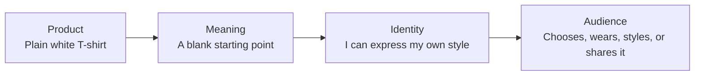

# Chapter 2: Archetypes—Giving Brands Meaning

A product can do more than solve a problem. It can also suggest a feeling, a way of life, or a kind of person someone wants to be.

**Archetypes** are familiar roles and story patterns. They give us a simple way to talk about the meaning a brand offers. They are not fixed personality types. People and brands can show more than one archetype, and people may read the same brand differently depending on their culture and situation.

When thinking about a brand, ask:

> What does the audience get to feel, imagine, or become by choosing this brand?

The answer should fit the real product and experience. A story cannot give a product benefits it does not have.

## A useful set of archetypes

Here are twelve common archetypes. Use them as ideas to explore, not as strict labels.

| Archetype | Main idea | A brand might focus on | The audience might feel |
|---|---|---|---|
| **Explorer** | Freedom and discovery | New places and trying new things | “I can find my own way.” |
| **Sage** | Learning and truth | Clear explanations and evidence | “I can make a good choice.” |
| **Creator** | Making something new | Craft, ideas, and self-expression | “I can make something of my own.” |
| **Ruler** | Order and responsibility | Clear standards and good leadership | “I can take charge.” |
| **Caregiver** | Help and protection | Comfort, support, and care | “I can care for myself or others.” |
| **Rebel** | Breaking from convention | Independence and change | “I do not have to follow the usual rules.” |
| **Hero** | Facing a challenge | Effort and achievement | “I can do something difficult.” |
| **Everyperson** | Belonging | Familiar, everyday experiences | “I fit in here.” |
| **Innocent** | Hope and simplicity | Ease and fresh starts | “Things can be simple and good.” |
| **Jester** | Fun and play | Humor and surprise | “I can enjoy myself.” |
| **Lover** | Connection and pleasure | Beauty, closeness, and care | “I can feel close to what I love.” |
| **Magician** | Change and possibility | A new view or a big change | “Things can be different.” |

A picture or a tone of voice is not enough to define a brand. A mountain picture alone does not make a brand an Explorer. Look at the product, the brand’s actions, and the whole experience.

## One shirt, several meanings

Imagine the same plain white T-shirt in every example below. The shirt itself does not change. Only the story around it changes.

| How the shirt is presented | Archetype | What the audience might think |
|---|---|---|
| “A blank starting point. Make it yours.” Show it with different outfits or invite people to customize it. | Creator | “I can make this my own.” |
| “An easy choice for an ordinary day.” Show it in familiar everyday settings. | Everyperson | “This fits into my life.” |
| “Wear your own rules.” Pair it with a message that challenges a dress convention. | Rebel | “I can choose for myself.” |
| “Ready for wherever the day takes you.” Show it as an easy item to pack for changing plans. | Explorer | “I can go my own way.” |

These are four different ways to give the same shirt meaning. One focuses on creativity, one on familiarity, one on independence, and one on freedom.

The story should not suggest that the shirt is unusually durable, responsibly made, or specially designed unless there is evidence for that claim. Keep the story honest.

The experience can also change the meaning. A helpful care guide might make the brand feel like a Caregiver. A funny design might feel like a Jester. The words and the experience should support each other.

## From product to audience identity

Here is one way a product can connect to how someone sees themselves:

This is one possible path, not a promise. Some people may not see the meaning the brand intended. Others may choose the shirt for a practical reason, like its price or fit.

## Making archetypes practical

Try these steps:

1. **Think about the audience’s needs.** What are people trying to do, feel, or express?
2. **Choose the meaning.** For example: “This shirt gives people a simple way to express their style.”
3. **Find the archetype that fits.** Creator may fit better than Ruler because the idea is about self-expression, not taking charge.
4. **Connect the story to the real product.** If you say the shirt is easy to style, show a few ways to wear it. Do not make claims you cannot support.
5. **Check the whole experience.** Do the product details, pictures, service, and words tell the same story?
6. **Ask people what they think.** Their understanding may be different from what the team intended.

For example, an event team might offer the white shirt as an easy-to-coordinate option for volunteers. That gives it an Everyperson feel: simple and familiar. If volunteers are invited to decorate their shirts together, the Creator idea may fit better. The right choice depends on the experience the team wants to offer.

## Archetypes Are Not Destiny

Archetypes are ways to explore meaning. They are not boxes for people or permanent labels for brands.

- **People have many sides.** Someone may want comfort, self-expression, and a good price all at once.
- **The situation matters.** A white shirt might feel simple at home, like a uniform at work, or like a blank canvas at an art event.
- **Culture matters.** Humor, authority, care, and belonging can mean different things to different groups.
- **Archetypes can mix.** A brand might offer practical help like a Caregiver and clear information like a Sage.
- **Actions matter more than labels.** Calling a brand caring does not make it caring. People notice what the brand actually does.

Use archetypes to ask questions, not to stereotype people or hide a gap between what a brand says and what it does.

## Questions to Ask When Choosing an Archetype

1. What might people feel, imagine, or become by choosing this brand?
2. What about the real product or experience supports that idea?
3. Which archetype fits the invitation we want to make?
4. Could the same product tell a different story?
5. Do the product and experience support the story?
6. Are any claims factual? Can we prove them?
7. Could people from different backgrounds understand the story differently?
8. Will people feel welcome even if they do not identify with the story?
9. What do people say the product means to them?
10. If this is the same white T-shirt, what changed besides the story?

## What You Should Remember

Archetypes are familiar story patterns that help brands offer meaning. They are not personality labels or rules. People and brands can show more than one, and culture and situation affect how a story is understood. Ask what people might feel, imagine, or become—and make sure the real product and experience support that idea.
