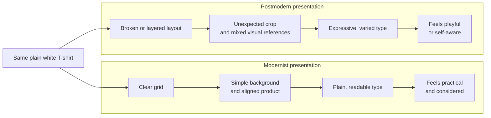
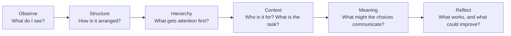

# Chapter 3: Modernism, Postmodernism, and Visual Language

Design is more than decoration. Choices about type, color, space, images, and layout help people decide what something means. A clean grid might suggest order and efficiency. A playful mix of styles might suggest personality or challenge the idea that there is only one right way to design.

These choices form a kind of **visual language**. To read a design, look at its choices and ask what they invite you to notice, feel, or believe.

## A short path into modernism

In the late 1800s and early 1900s, industrial production and growing cities changed how people lived and what they saw. New technologies and materials shaped buildings, products, printing, and communication. Many designers began looking for forms suited to modern life rather than simply copying older styles.

Modernism was not one single style. It included different movements and ideas, but many modernist designers valued clear structure, useful design, and forms suited to their purpose. Some believed design could serve a broad public and work across different places and audiences.

### Bauhaus

The Bauhaus was a German school of art, design, and architecture founded in 1919. It brought together different creative fields and connected artistic practice with making and industry. Its teachers and students explored how form, materials, craft, and function could work together.

The Bauhaus was not a single look, and its work changed over time. Still, it became strongly associated with modern design education and the idea that design could connect art with everyday life.

### Swiss / International Typographic Style

In the mid-20th century, designers in Switzerland and elsewhere developed what became known as the Swiss or International Typographic Style. It often used grids, clear alignment, strong type hierarchy, and photography or simple graphic forms. The goal was to make information clear and organized.

The grid is a guide for arranging elements, not just a visible set of lines. It can help a designer align text and images, create a consistent rhythm, and make a page easier to scan.

Modernist principles often include:

- **Grid:** Use an underlying structure to organize content.
- **Hierarchy:** Make the most important information easiest to notice.
- **Clarity:** Help people understand what they are seeing.
- **Reduction:** Remove details that do not serve the message.
- **Function:** Let the design support what people need to do.

These principles can make communication easier. But they are not neutral rules. A designer still decides what counts as important, what gets removed, and whose needs the design serves.

## Postmodernism: questioning the rules

From the later 20th century onward, many designers and artists challenged the idea that one orderly, restrained style could work for everyone. Postmodern design often welcomed **plurality**—the presence of many styles and points of view. It could use irony, disruption, quotation, and expressive typography.

Postmodern work might deliberately mix visual references, interrupt a neat layout, or make type feel like an image. These choices can question authority, celebrate identity, or create humor. They can also make information harder to use if expression takes over completely.

Modernism and postmodernism are not two sealed boxes, and postmodernism did not make modernist ideas disappear. Designers still combine them. A clear grid may hold expressive type; a playful interface may still use strong hierarchy to help people complete a task.

## The tension continues

Many design choices sit between two useful but competing aims:

| Design tension | Modernist tendency | Postmodern tendency | A question for today |
|---|---|---|---|
| Order and disruption | Keep elements structured | Break or interrupt the structure | Should this experience feel calm, surprising, or both? |
| Universality and identity | Aim for broad, consistent communication | Make room for specific voices and perspectives | Who is this design for, and who might it leave out? |
| Clarity and expression | Make the message direct and easy to scan | Let style carry personality and feeling | What must be understood quickly, and where can the design be expressive? |
| Grid and anti-grid | Align content to a consistent system | Shift, overlap, or break alignment | Does a break in the grid add meaning or just confusion? |
| Restraint and abundance | Use fewer elements and simplify | Layer styles, references, and detail | What deserves attention, and how much is too much? |
| Function and irony | Help people complete a task | Play with or question the expected task or form | Is the joke clear, and can people still use the design? |

Neither side is automatically better. A design can be clear without being plain, expressive without being confusing, or orderly without pretending to suit every person.

## The same shirt, two visual languages

Imagine the exact same plain white T-shirt: same fabric, cut, color, and price.

- **A modernist presentation** might photograph it against a simple background, align the product details in a clean grid, and use a restrained typeface with clear headings. The shirt may feel practical, direct, and carefully considered.
- **A postmodern presentation** might pair it with clashing colors, layered type, unexpected cropping, or references to different visual styles. The same shirt may feel playful, rebellious, or self-aware.

The design changes the way the shirt is interpreted, not what the shirt is made of. Neither presentation should imply qualities—such as special performance or production practices—that the product does not have.

The diagram is a schematic, not a product advertisement. Both sides show the same shirt; the layout and type create different impressions.

## Contemporary digital design

These older design questions still show up on websites, apps, and digital products:

- A payment form may use a grid and clear hierarchy so people can find the total and finish a task.
- A music or arts site may use oversized type, unusual layouts, and vivid images to express a distinct identity.
- A product dashboard may keep its main actions orderly while using color or motion to draw attention to a key change.
- A campaign page may break a familiar layout to make a point, while still keeping navigation and essential information easy to find.

Digital design often needs both structure and character. A consistent layout can make a service easier to learn, while expressive details can help it feel distinct. If a surprising interaction hides an important control, the disruption may get in the way. If every page looks interchangeable, the design may communicate little about who made it or whom it serves.

## How to Read a Design

When you look at a poster, package, website, or app, try these steps:

1. **Notice your first impression.** What do you think this design is for? What feeling does it create?
2. **Look at the structure.** Is there a grid? What is aligned, grouped, or separated?
3. **Find the hierarchy.** What do you notice first, second, and third? How do size, color, position, or type guide your eye?
4. **Pay attention to type and images.** Do they feel formal, playful, familiar, unusual, or something else?
5. **Look for a rule—and any breaks in it.** Does the design stay consistent, or interrupt its own pattern? What might that communicate?
6. **Consider the audience and task.** Who might feel included? Can people find what they need?
7. **Separate observation from interpretation.** “The text is aligned on the left” is an observation. “The design feels orderly” is an interpretation.
8. **Ask what could be improved.** What could be clearer, more expressive, or more welcoming without losing what works?

Use this quick path to move from what you see to what you think it means:

For example, “the heading is much larger than the rest of the text” is an observation. “The heading must be important” is an interpretation. Check the rest of the design and its context before deciding what it means.

## Museum Research

Museum and institutional collections can help you study real design objects and learn how they are described and dated. Try searching collections at The Metropolitan Museum of Art, MoMA, Cooper Hewitt, the V&A, Bauhaus archives, or another credible museum or institution.

Use search terms such as:

- `Bauhaus poster`
- `Swiss graphic design poster`
- `International Typographic Style`
- `modernist typography`
- `postmodern graphic design`
- `experimental typography`

Search results may include objects that are not relevant to your question. Open the collection record and verify the object’s title, maker, date, medium, and institutional description. Do not assume that an image is an authentic example just because it appears in a search. If you use an object in an assignment, cite the actual collection record and follow your class’s citation instructions.

## What You Should Remember

Visual design carries meaning through choices about structure, type, images, space, and style. Modernist traditions often value order, clarity, reduction, and function. Postmodern approaches may use plurality, irony, disruption, quotation, and expressive type to question a single universal style. These ideas still mix in digital design. Read the choices in front of you, consider whom they serve, and ask whether the design communicates what it intends.
