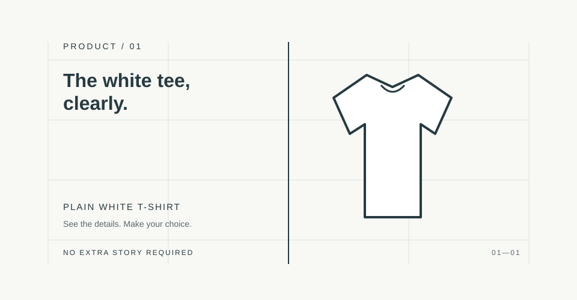
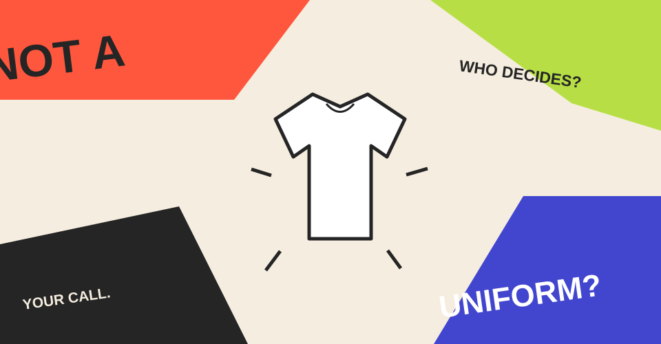
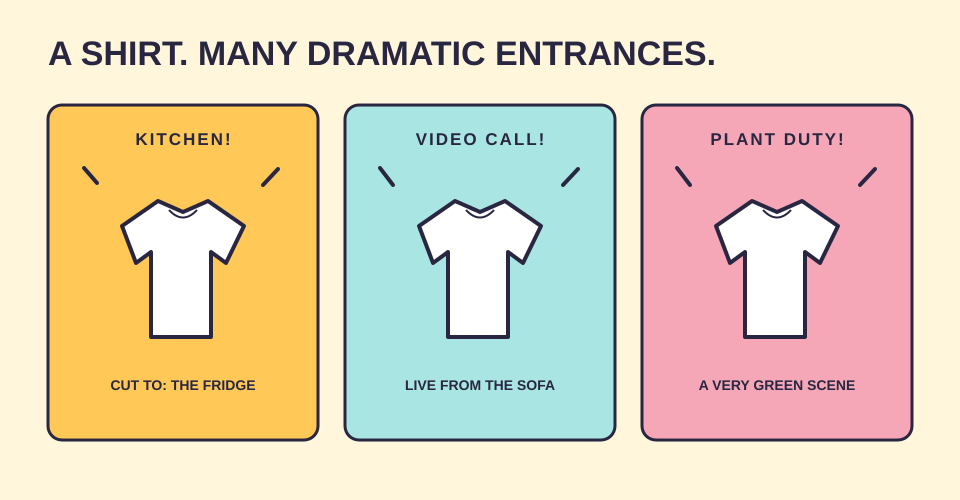
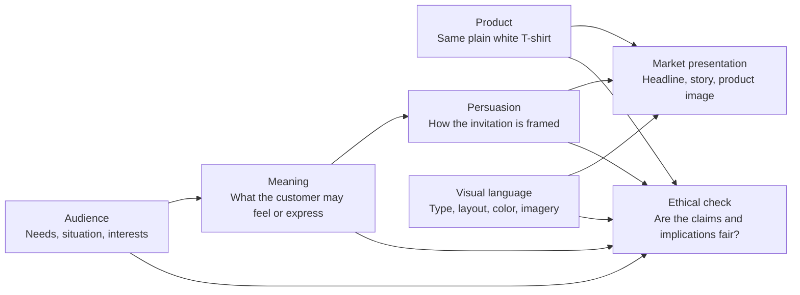

# Chapter 4: One White T-Shirt, Four Very Different Stories

Here is the brief: sell a plain white T-shirt.

That sounds simple until you ask what “sell” means. Is it an invitation to explore? A clear, no-nonsense choice? A small act of rebellion? A reason to play? The shirt can stay exactly the same while the presentation changes almost everything around it.

For this exercise, assume only that it is a plain white T-shirt. We do not know its fabric, price, origin, fit, environmental impact, or how long it lasts. None of the concepts below should pretend otherwise.

Each concept is a different answer to the same question:

> What is the customer actually being invited to buy—the object, or a meaning the object can help express?

## Concept 1: The Explorer — “Take the long way”

**Audience:** People who like the idea of an open day, an unplanned walk, or choosing their own route. This is a design audience, not a claim that every customer lives this way.

**Chosen brand archetype:** Explorer.

**Persuasion principles being used:** Aspirational framing and autonomy. The presentation connects the shirt with the possibility of going somewhere, while leaving the choice with the audience. It does not use scarcity or claim that the shirt makes travel easier.

**Visual-design language:** Open, spacious, and documentary in feel. Use a wide landscape crop, plenty of sky or blank space, and a small figure in the distance. Keep the type simple so the scene has room to breathe.

**Headline:** “Take the long way.”

**Short product story:** A white shirt is one item in the picture, not the hero of an epic expedition. Show it worn on an ordinary outing: a path, a station platform, or a roadside stop. The story is about deciding where to go, not about the shirt enabling a feat.

**Imagery direction:** Photograph the same plain shirt on a person in a real, everyday outdoor setting. Avoid extreme terrain, staged danger, or visual cues that imply technical outdoor performance. The shirt should look like the same shirt in every concept.

**Meaning the customer is invited to buy:** “I can be open to a change of plan. I choose my own direction.”

**Ethical concern or possible misuse:** Adventure imagery can imply performance, protection, or durability. Do not suggest this is technical gear unless those qualities are verified. Also avoid implying that buying the shirt is the same as having an adventurous life.

**Why it feels different:** The shirt is a companion to a possible experience. The imagined journey matters more than the product specification.

## Concept 2: The Sage — “The white tee, clearly.”

**Audience:** People who want to understand what they are choosing and dislike vague product language.

**Chosen brand archetype:** Sage.

**Persuasion principles being used:** Clear framing and informed choice. Use information hierarchy to make verified details easy to find. If important details are not yet known, mark them for confirmation instead of filling the gaps with persuasive-sounding guesses.

**Visual-design language:** Restrained modernist, with a Swiss-influenced grid. Show one straightforward product image, align the text and image carefully, use a readable typeface, and make the heading and details easy to scan. Keep decoration to a minimum.

**Headline:** “The white tee, clearly.”

**Short product story:** No grand promise: just a plain white T-shirt, described in plain language. A finished product page would list confirmed details—such as material, available sizes, care instructions, and price—so customers can compare and decide. This case study does not invent those details.

**Imagery direction:** Use an evenly lit front view of the shirt, plus a back view if useful. Keep the background neutral. Show the same shirt without dramatic styling or retouching that changes its apparent color or shape.

**Meaning the customer is invited to buy:** “I can make a considered choice without decoding a big brand story.”

**Ethical concern or possible misuse:** A clean grid can make incomplete information look official or complete. Do not use a polished layout as a substitute for evidence, and do not present missing details as positive features.

**Why it feels different:** The presentation reduces the story. The customer is invited to value clarity and control rather than escape or spectacle.

## Concept 3: The Rebel — “Not a uniform. Unless you say so.”

**Audience:** People who enjoy questioning dress expectations and making their own choices about what feels ordinary or formal.

**Chosen brand archetype:** Rebel.

**Persuasion principles being used:** Reframing and contrast. The headline turns the idea of a “basic” into a question: who gets to decide what counts as a uniform? The tension is in the message, not in a false claim about the shirt.

**Visual-design language:** Disruptive and postmodern. Use intentionally uneven alignment, oversized type, abrupt cropping, and a clash between a very plain product image and a loud layout. Keep essential product details readable; disruption should not hide the information needed to choose.

**Headline:** “Not a uniform. Unless you say so.”

**Short product story:** The shirt is shown as an ordinary garment that can be worn on a person’s own terms. The campaign plays with the contradiction: a simple shirt can be uniform-like, expressive, or just a shirt, depending on who is wearing it and why.

**Imagery direction:** Pair a straightforward image of the unchanged white shirt with graphic interruptions—such as a large type block or a sharply cropped frame. Do not add printed graphics to the shirt itself; the visual disruption belongs to the campaign.

**Meaning the customer is invited to buy:** “I get to decide what this everyday object means to me.”

**Ethical concern or possible misuse:** Rebellion can become a hollow pose or suggest that people who prefer conventional clothing are weak or boring. Keep the challenge directed at expectations, not at customers. Make sure irony does not obscure price, product details, or other decision-critical information.

**Why it feels different:** The design refuses to sit quietly. It makes the framing itself part of the message.

## Concept 4: The Jester — “A shirt. Many dramatic entrances.”

**Audience:** People who enjoy playful styling, small jokes, and treating everyday choices with a light touch.

**Chosen brand archetype:** Jester.

**Persuasion principles being used:** Humor, surprise, and liking. The campaign aims to make the product enjoyable to look at, not to pressure people through urgency or imply that popularity proves quality.

**Visual-design language:** Bright, theatrical, and deliberately over-serious about a very ordinary object. Use playful captions, unexpected scale, and a sequence of simple scenes. Keep the shirt plain and unchanged; the joke comes from the presentation.

**Headline:** “A shirt. Many dramatic entrances.”

**Short product story:** Present the same white T-shirt entering a series of ordinary moments as if each were a grand premiere: opening the fridge, joining a video call, or remembering to water a plant. The humor comes from giving a basic shirt an absurdly important role.

**Imagery direction:** Photograph the unchanged shirt in simple, everyday scenes, then use framing and captions to make each appearance mock-dramatic. Avoid suggesting that the shirt has a special fit, feel, or performance.

**Meaning the customer is invited to buy:** “I can find a little fun in everyday life—and I do not need every purchase to be profound.”

**Ethical concern or possible misuse:** Humor can make unclear terms or weak information easy to overlook. Keep the joke separate from factual claims, and make the actual product description easy to find. Do not make the audience or a protected group the punchline.

**Why it feels different:** Instead of promising freedom, certainty, or resistance, this concept offers a moment of amusement.

## Four stories, one physical product

The concepts vary the audience, meaning, persuasion, and visual language. The shirt itself remains plain white and substantially the same.

| Concept | Audience | Archetype | Persuasion approach | Visual language | Meaning offered | Main ethical check |
|---|---|---|---|---|---|---|
| Take the long way | People drawn to open-ended outings | Explorer | Aspiration and autonomy | Spacious, documentary | “I choose my own direction.” | Do not imply technical performance. |
| The white tee, clearly | People who want straightforward information | Sage | Clear framing and informed choice | Restrained modernist / Swiss-influenced | “I can decide with confidence.” | Do not let polish conceal missing facts. |
| Not a uniform | People who question dress expectations | Rebel | Reframing and contrast | Disruptive, postmodern | “I choose what this means.” | Do not shame conventional choices or hide details. |
| Many dramatic entrances | People who enjoy playful everyday humor | Jester | Humor and surprise | Bright, theatrical, exaggerated | “Everyday life can be fun.” | Do not let the joke bury product information. |

## How the parts make a presentation

The product alone does not determine the campaign. The audience shapes which meaning is relevant; persuasion choices shape how that meaning is offered; visual language makes the offer visible. Put the parts together, then check that the resulting presentation is honest.

The diagram is a planning aid, not a formula for predicting sales. Real audiences may read the same presentation in different ways. Research, testing, and honest product information still matter.

## Try the exercise

Choose one of the concepts and sketch a simple advertisement or product page. Keep the shirt unchanged. Then ask a classmate:

1. What did you notice first?
2. Who did this seem to be for?
3. What did the shirt seem to promise?
4. Which parts of the presentation created that impression?
5. Did anything suggest a product fact that the design brief did not provide?

If the answers differ from your intention, that is useful information. Adjust the presentation—not the facts—to make the invitation clearer.

## What You Should Remember

The same product can support very different market presentations. Audience, meaning, persuasion, and visual language work together to create the invitation. A campaign may sell a sense of possibility, clarity, independence, or fun, but it should not pretend those feelings are product features. Keep the shirt—and the facts—honest, and let the design make its meaning clear.
