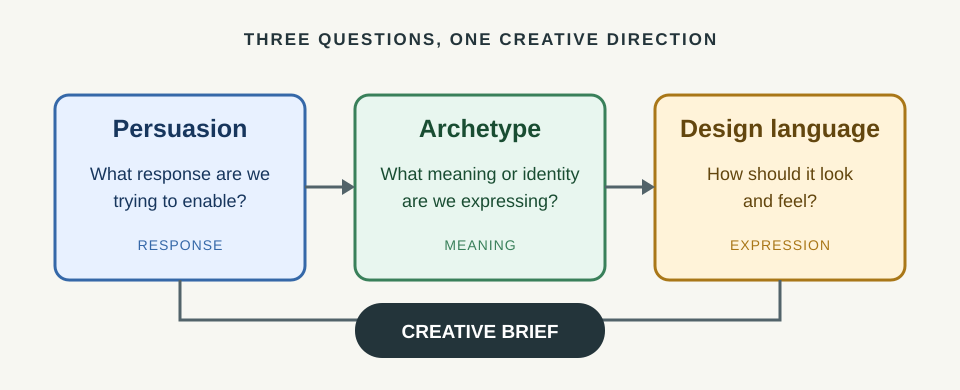
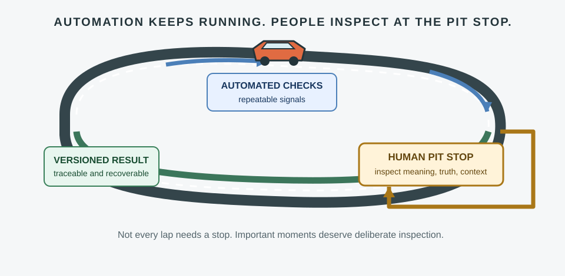
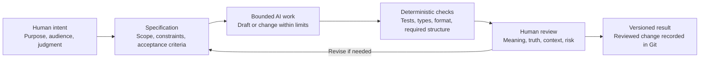

# Chapter 5: Directing the Work—Design Thinking for AI-Assisted Projects

So far, we have looked at three ways to guide a creative decision:

- **Persuasion:** What response are we trying to enable?
- **Archetype:** What meaning or identity are we expressing?
- **Design language:** How should that meaning look and feel?

Together, these questions help people make a brief more useful. They also help when asking an AI tool to make something. AI can draft, transform, and check work, but it needs direction. A clear human purpose gives the work a destination; a specification gives it boundaries; review helps decide whether the result deserves to get there.

## Three questions, one direction

Think of the three ideas as connected controls, not separate style settings. Start with the response you want to make possible. Choose a meaning that fits the audience and the product. Then choose a visual language that makes that meaning understandable.

For example, suppose a team is making a product page for the same plain white T-shirt from the earlier chapters:

- **Persuasion:** Help visitors understand the offer and decide whether to explore it.
- **Archetype:** Use the Sage: offer clarity and informed choice.
- **Design language:** Use a restrained grid, clear headings, and straightforward product imagery.

That is a direction, not a finished specification. It does not tell the team to invent fabric details, prices, or benefits. Those need to come from verified product information.

The same framework works for technical and creative tasks. If an AI is asked to write interface copy, generate a layout, or update a component, the team can still ask: What response should this support? What meaning should the experience communicate? What should the output look and feel like?

## Why bound an AI task with a specification?

A request such as “make this better” gives an AI little to aim at. A **specification** makes the task specific enough to do and review. It can include:

- **Purpose:** What problem are we trying to solve?
- **Audience and context:** Who will use the result, and where?
- **Scope:** What files, features, or content may change?
- **Constraints:** What must stay the same? What must not be invented or altered?
- **Deliverable:** What should the AI produce?
- **Acceptance criteria:** What observable conditions will count as complete?

For a small interface task, a bounded request might be: “Revise the product-page headline and supporting copy for clarity. Keep the existing product facts unchanged. Do not add claims about materials or performance. Return the edited copy and note any missing information. The headline must fit within the existing component.” The details tell the AI both what to do and where to stop.

Good boundaries are not red tape. They reduce unwanted changes, make the result easier to inspect, and give the human reviewer a way to compare the output with the original intent. The person or team still has to decide whether the specification itself is sound.

## A dependable loop: checks, review, and version history

Different safeguards catch different problems. No single step proves that a result is good.

### Git gives the work a traceable history

Git records changes over time. A diff can show what changed; commits can preserve known points in the project’s history; and version-control workflows can help a team compare, discuss, and recover work.

That makes it easier to answer: What did the AI change? Which version was reviewed? Can we return to the previous version if this one causes a problem?

Git does **not** make a change correct just because it is saved. A commit is a record, not an approval stamp. Review the diff, and follow the team’s normal practices for branches, commits, and recovery.

### Deterministic checks are cheap, repeatable signals

An automated check is **deterministic** when the same inputs and conditions produce the same result. Examples include tests, type checks, formatters, link checks, and rules that validate a required file or output structure.

These checks are useful because they are usually fast to repeat and good at finding specific, defined problems. A test can report that a required behavior broke. A formatter can flag inconsistent formatting. Neither can decide whether a headline is respectful, the product story is truthful, or the experience serves its audience.

Choose checks that match the task. Treat a passing result as evidence about the checks that ran—not as proof that everything is correct.

### AI review can help, but it is probabilistic

An AI reviewer can be useful for finding possible omissions, inconsistencies, unclear wording, or cases worth checking. It can offer another perspective and help a reviewer form questions.

But AI review is **probabilistic**: it can overlook a real problem, raise a concern that does not apply, or give different answers to similar inputs. Use it as a source of leads, not as a final verdict. Verify important findings against the code, specification, tests, and context.

### Human judgment remains essential

People remain responsible for deciding whether the work is right for its audience and situation. That includes judgment about meaning, truthfulness, context, accessibility, risk, and trade-offs—and the final decision to accept, revise, or reject the result.

An AI can help produce a design or inspect it. It cannot take responsibility away from the people who choose to use it.

## The pit-stop principle: inspect the moments that matter

Imagine an automated racing team. The car can keep moving around the track, and routine systems can keep doing their jobs. But at selected moments, the car comes into the pit for deliberate inspection and service. The crew does not stop the race after every turn; it also does not assume that speed alone means everything is fine.

AI-assisted work benefits from the same rhythm. Let repeatable automation run throughout the process. Bring in a human reviewer at meaningful checkpoints: before a change is merged, before content is published, after an unusual result, or whenever the stakes are high. The right checkpoints depend on the project. A human review should have a clear purpose, such as checking changed files, confirming product claims, or judging whether the experience suits its audience.

The metaphor is about **selective attention**, not a guarantee. A pit stop cannot catch every possible issue. It gives people a deliberate chance to inspect important work instead of either reviewing every tiny operation or trusting automation blindly.

## A simple AI-assisted workflow

The workflow is a loop, not a one-way conveyor belt. If review finds a problem, improve the specification or the work and run the relevant checks again. If a check fails, investigate instead of treating the failure as a nuisance to bypass.

| Stage | Useful question | What it can contribute | What it cannot guarantee |
|---|---|---|---|
| Human intent | What are we trying to make possible, and for whom? | Purpose, context, priorities | That the initial goal is complete or fair |
| Specification | What is in scope, and how will we recognize success? | Clear boundaries and review criteria | That every requirement is wise or sufficient |
| Bounded AI work | Can the tool produce a useful draft or change within those limits? | Speed, alternatives, implementation help | Truth, fit, or correctness by itself |
| Deterministic checks | Do defined, repeatable rules pass? | Fast feedback on specific failures | Overall quality, meaning, or suitability |
| Human review | Does this make sense here, for these people, with these consequences? | Judgment and accountability | Perfect prediction of every outcome |
| Versioned result | What changed, and how can we trace or recover it? | History, comparison, and a recovery path | Correctness merely because it was recorded |

## Put the framework into a brief

Before asking an AI to create or change something, write a few lines:

1. **Response:** What should a person be able to understand, decide, or do?
2. **Meaning:** What should the work communicate about the product or organization?
3. **Visual or interaction language:** What should it look and feel like?
4. **Boundaries:** What facts, files, behaviors, or design elements must not change?
5. **Checks:** Which automated checks can verify specific requirements?
6. **Human checkpoint:** Who will inspect the result, and what must they judge?
7. **Record:** How will the final reviewed change be recorded and recoverable?

For the T-shirt page, that might mean: help visitors compare the shirt and decide whether to learn more; express a Sage-like commitment to clarity; use a simple grid and readable type; do not invent product facts; run the project’s relevant content and code checks; have a person verify every claim and the page’s audience fit; then record the accepted change in Git.

This is not a magic prompt. It is a way to make purpose, limits, and responsibility visible before the work begins.

## Questions for Next Week

1. What is one task you could make easier to review by writing acceptance criteria first?
2. Which parts of that task could be checked automatically, and what would those checks miss?
3. Where should a person pause for a deliberate review? What should they look for?
4. How could Git help your team understand or recover a change made with AI assistance?
5. What is one claim or design choice that requires human judgment about context or meaning?
6. If an AI review disagrees with a test or a human reviewer, what evidence would help resolve the disagreement?
7. How might persuasion, archetype, and visual language clarify the direction of an AI-generated result?

## What You Should Remember

Persuasion sets the response a design should enable; archetype gives that response meaning; design language makes the meaning visible and felt. In AI-assisted work, a clear specification bounds the task, deterministic checks provide repeatable signals, AI review offers fallible suggestions, and Git makes changes traceable and easier to recover. Automation can keep running, but people must inspect important moments and remain responsible for truth, context, meaning, and the final decision.
